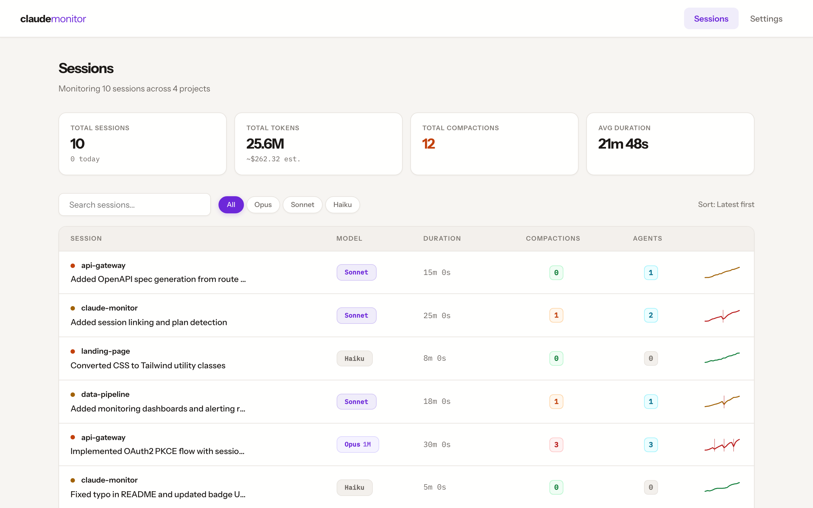
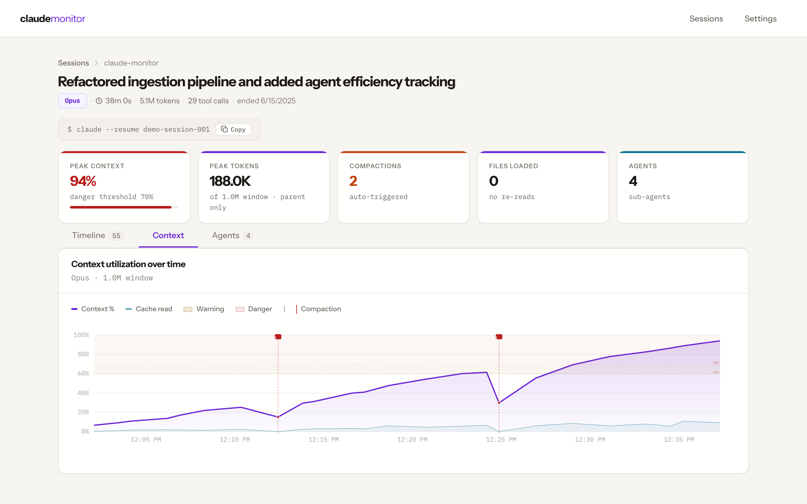
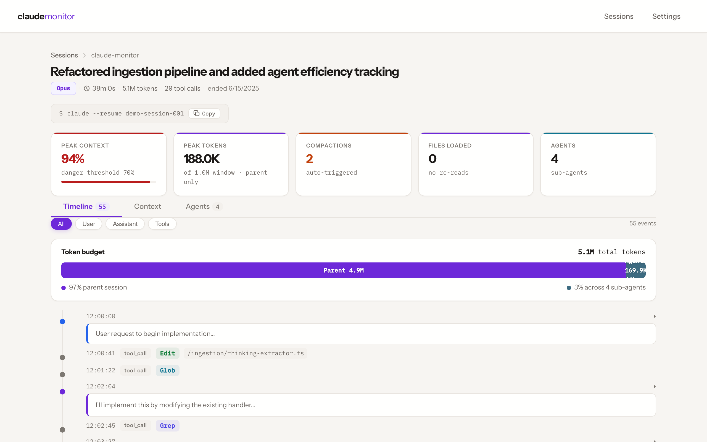
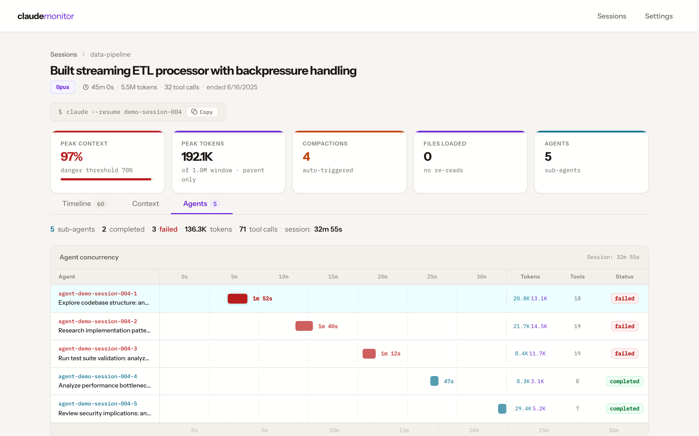

# claude-monitor

> Local observability dashboard for Claude Code sessions — see what your context window is actually doing.

[](https://github.com/pigorv/claude-monitor/actions/workflows/ci.yml)
[](https://www.npmjs.com/package/@pigorv/claude-monitor)
[](./LICENSE)
[](https://nodejs.org/)

<p align="center">
  <video src="https://github.com/user-attachments/assets/478ee4ca-035f-4322-8bb5-97756071e8f0" controls="controls" muted="muted" style="max-width: 100%;"></video>
</p>

## Why?

Claude Code sessions generate rich transcript data, but you can't see what's happening under the hood:

- **Context fills up silently** — you don't know you're at 90% until output quality drops. claude-monitor shows token utilization over time with warning and danger zones.
- **Files bloat your context** — every file read burns tokens, and re-reads of the same file waste context you can't afford. claude-monitor tracks which files were loaded, how many times, and how much context each one consumed.
- **Sub-agent calls are opaque** — spawned agents consume tokens and return results you never see. claude-monitor maps the full agent tree with per-agent token costs, Gantt timelines, tool breakdowns, and result classification.
- **Compactions are invisible** — when Claude compresses its context, you lose information silently. claude-monitor marks every compaction on the timeline so you can see exactly when and how much was lost.

## Quick Start

First, import every existing Claude Code session from `~/.claude/projects/`:

```bash
npx @pigorv/claude-monitor import ~/.claude/projects/
```

Then start the dashboard — it opens at `http://localhost:4173` and tracks only newly added sessions going forward:

```bash
npx @pigorv/claude-monitor start
```

**Requirements:** Node.js >= 20, Claude Code (for transcript files)

## Features

**Session List** — Filterable, sortable table with model filter chips, search, sparkline previews, and color-coded compaction counts.



**Context Pressure** — Interactive token chart (uPlot) with input/output/cache breakdown, model-specific thresholds, compaction markers, and drag-to-zoom.



**Thinking Inspection** — Expandable thinking blocks in the event timeline. See exactly where Claude's reasoning chain took a wrong turn.



**Agent Tree** — Full sub-agent visibility with Gantt timeline, per-agent token costs, tool call breakdowns, compression ratios, and result classification. See which agents ran in parallel, which ones failed, and how much context each one consumed.



**File Tracking** — See every file loaded into context, how many times it was re-read, and how many tokens each file consumed. Spot wasteful re-reads and files that bloat your context window.

## How It Works

The `start` command watches `~/.claude/projects/` for JSONL transcript files. Each transcript is parsed into thinking blocks, tool calls, token snapshots, and compaction events, then stored in a local SQLite database (`~/.claude-monitor/data.sqlite`). The dashboard reads from this database — no data leaves your machine.

## CLI Reference

| Command | Description |
|---------|-------------|
| `claude-monitor start` | Start dashboard + auto-import (default port: 4173) |
| `claude-monitor import <path>` | One-time import of transcripts |
| `claude-monitor status` | Show database stats and server status |

Options for `start`: `--port, -p <number>`, `--no-open`, `--db <path>`, `--verbose`

Options for `import`: `--force` (re-import existing sessions)

## Built With

[](https://www.typescriptlang.org/)
[](https://preactjs.com/)
[](https://hono.dev/)
[](https://www.sqlite.org/)
[](https://github.com/leeoniya/uPlot)

## Development

```bash
git clone https://github.com/pigorv/claude-monitor.git
cd claude-monitor
npm install
npm run build          # Build CLI + frontend
npm run dev            # Start server in dev mode
npm run dev:frontend   # Start Vite dev server
npm test               # Run tests
npm run typecheck      # TypeScript type checking
```

## Contributing

See [CONTRIBUTING.md](./CONTRIBUTING.md) for development setup and conventions.

## License

[MIT](./LICENSE)
